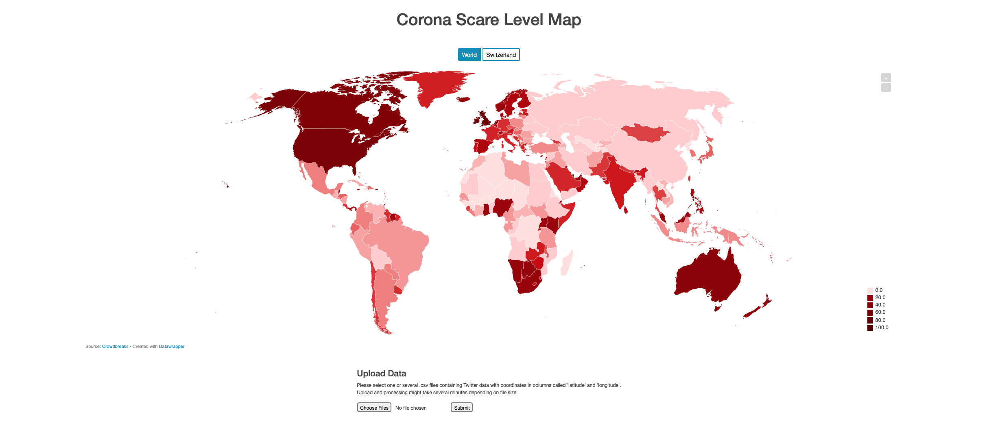
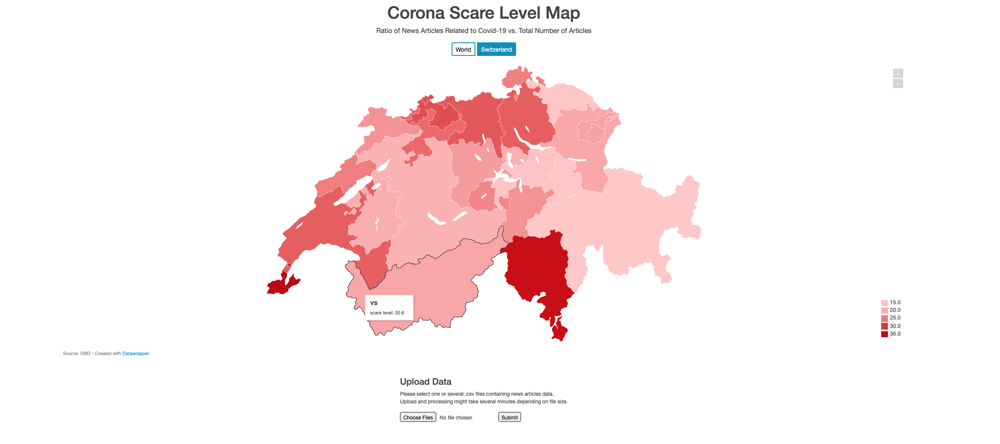

### HackZurich 2020
# #12 CORONA SCARE APPLICATION

The corona pandemic map of Johns Hopkins university is well known. We would like to go a step beyond and find a way to map the impact of the virus on people's emotions: How upset are they? How threatened do they feel, how scared? Assuming that there is a correlation between how scared people are and how many news (faked or real news) are posted around them, we define the "Corona Scare Level" in an area as proportional to the number of corona related news that pop up in that same area. :basecampy:

### The Process
#### World Map
We started with the Twitter dataset we had been provided with. It was relatively easy to reverse geocode the data, since we were provided with coordinates. We've used a python package called `reverse-geocode` for this process which is an offline and quick solution. The module has a set of known geocoded locations and uses a k-d tree to efficiently find the nearest neighbour. In our perspective, the main challenge with the Twitter data was to make it useable for a map/chart. Since the Twitter dataset contained tweets from all over the world, we decided to portray our results in a world map. Of course, the number of Twitter users needs to be taken into account when calculating the Scare Level of a country and since this data wasn't availabe for all countries, we decided to approximate the figure using the country's population. Furthermore, the Tweets per capita numbers were normalized into a scale from 0 to 100.

#### Switzerland
For the SDM data, we focused on Switzerland which is also the main aspect of the challenge. At first, we tried to use natural language processing (NLP) to extract location names (Name Entity Recognition). However, we weren't able to achieve desirable results with our approach: processing the big amount of data wasn't possible for us in a reasonable time. Therefore, we switched to another technique using keywords to detect locations and assign them to their correspongig canton. Similarly, using keywords, we tried to detect news articles which were related to Corona. In the map itself, the ratio of articles that mention a specific location and Corona vs. total amount of articles that mention the location is displayed and is our interpretation of the "Corona Scare Level" in Switzerland.

### Where to go from here
Since we are rather unexperienced programmers, our main focus for the project was on having a more or less "finished" and working "product" rather than putting a lot of effort into details and precision. The user interface could be made more appealing, the data processing has many possibilities for improvment (use name entity recognition/machine learning, better approaches to compare scare level of different countries/cantons, speed up processes) and other features would be desireable such as the possibilty to select a time span etc.) 

### Technologies used
We decided to implement our project as a small web application using a Python backend (Flask) to do the data processing. On the frontend, we used the Datawrapper API to create the visualizations. Used programming languages and important packages:
* Python 3.7.9
    * flask
    * pandas
    * reverse-geocode
    * scikit-learn
    * datawrapper
* HTML/CSS
    * Bootstrap
    * Embed Datawrapper iFrame
